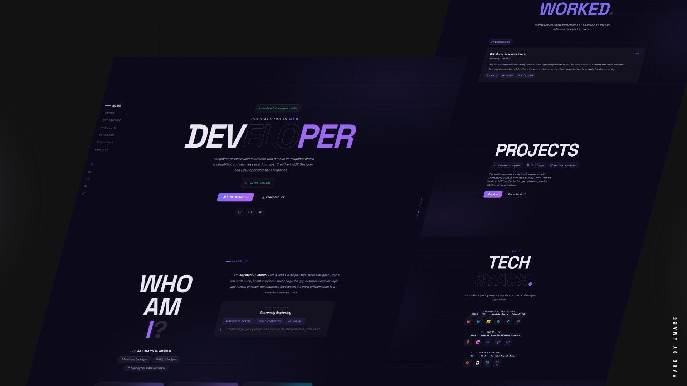
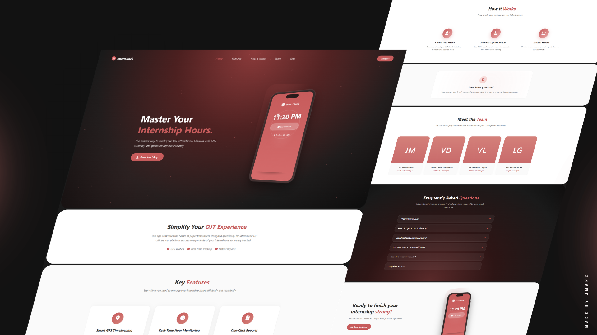
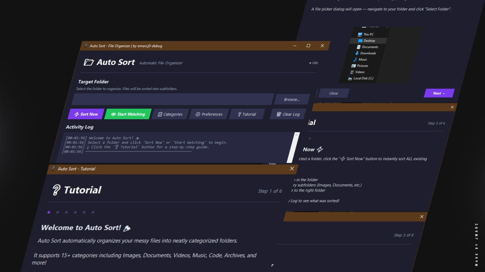
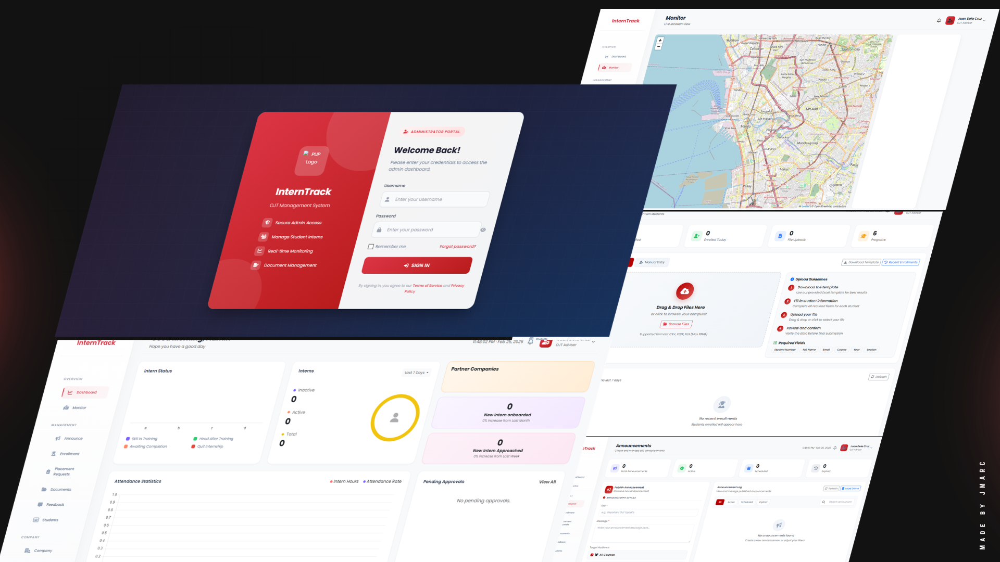
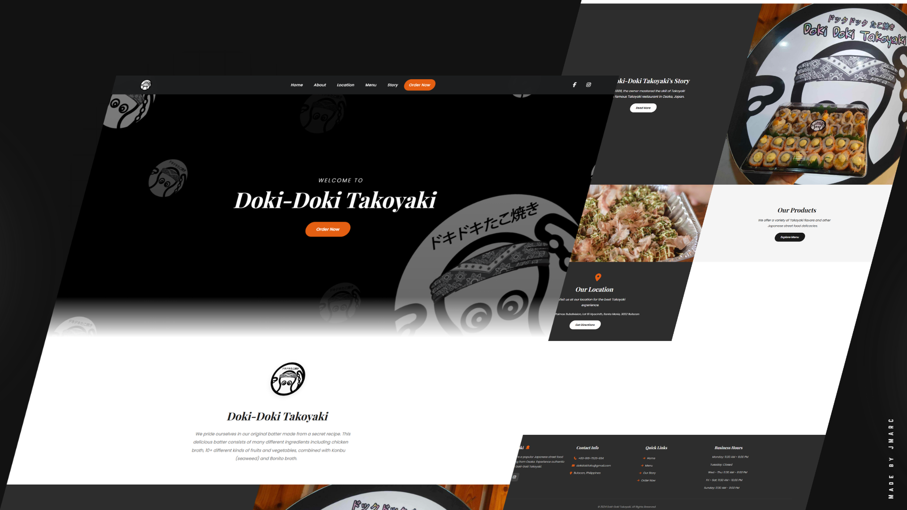

<!-- Header Banner -->

  

<!-- Typing SVG -->

  

<!-- Social Badges -->

  
  
  
  
  
  

 

<!-- About Me Section -->

## 🧑‍💻 &nbsp;About Me

> *"To be courageous is to face your fears with unwavering determination."*

🎓 &nbsp;**BSIT** student at **Polytechnic University of the Philippines** — Santa Maria, Bulacan Campus *(2022 – Present)*

💼 &nbsp;Former **Salesforce Developer Intern** at **SmartBridge**

🌱 &nbsp;Currently exploring **Responsive Design**, **React Ecosystem** & **UX Motion**

🎯 &nbsp;Focused on building **scalable interfaces** with seamless **user journeys**

📍 &nbsp;Based in **Santa Maria, Bulacan, Philippines** 🇵🇭

📫 &nbsp;Reach me at **jaymarccmerilo@gmail.com**

 

---

<!-- Tech Stack Section -->
## 🛠️ &nbsp;Tech Stack

### Languages & Frameworks
  

### Design & UX

### Tools & Platforms

---

<!-- GitHub Stats Section -->
## 📊 &nbsp;GitHub Analytics

  
  

---

<!-- Featured Projects Section -->
## 🚀 &nbsp;Featured Projects

<!-- Project 1: React Portfolio (Latest) -->

<table>
<tr>
<td width="50%">
<h3 align="center">🌐 React Portfolio</h3>

  

  Modern, dark-themed portfolio built with <strong>React</strong>, featuring smooth scroll animations with <strong>Framer Motion</strong> & <strong>Lenis</strong>, typing effects, and <strong>EmailJS</strong> contact form.

  
  
  
  

  
  

</td>
<td width="50%">
<h3 align="center">📋 InternTrack System</h3>

  

  Comprehensive OJT timekeeping & management system built with <strong>Next.js</strong> & <strong>TypeScript</strong>. Features GPS tracking, multi-portal system, and real-time updates.

  
  
  
  

  

</td>
</tr>
<tr>
<td width="50%">
<h3 align="center">🗂️ Auto-SorterEXE</h3>

  

  Desktop app that automatically sorts files into organized folders by type. Features <strong>Watch Mode</strong>, beautiful dark UI with <strong>Tkinter</strong>, and 15+ file categories.

  
  
  
  

  

</td>
<td width="50%">
<h3 align="center">� Admin InternTrack Portal</h3>

  

  Complete admin dashboard for the InternTrack system including <strong>Student Management</strong>, <strong>Attendance Monitoring</strong>, <strong>Report Generation</strong>, and multi-role access.

  
  
  
  

  

</td>
</tr>
<tr>
<td colspan="2">
<h3 align="center">🍢 Doki Takoyaki</h3>

  

  E-Commerce design concept for a Japanese food brand. Built with modern web technologies featuring a clean, appetizing UI with smooth interactions and responsive layout.

  
  
  
  

  

</td>
</tr>
</table>

---

<!-- Certifications Section -->
## 🏅 &nbsp;Certifications

| 🎖️ Certificate | 🏢 Issuer | 📅 Year |
|:---|:---|:---:|
| Salesforce Supported Virtual Internship Program | SmartBridge | 2025 |
| Capstone to Startup: Preparing Students for Innovation Challenges | DICT - Philippines | 2025 |
| Introduction to Cybersecurity | Cisco Networking Academy | 2024 |
| Introduction to Packet Tracer | Cisco Networking Academy | 2023 |

---

<!-- Activity Graph -->
## 📈 &nbsp;Contribution Graph

  

---

<!-- Profile Views & Quote -->

  
  
  
   
  
  
  

<!-- Footer Banner -->

